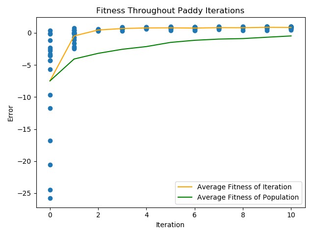

# Paddy: Evolutionary Optimization Algorithm for Chemical Systems and Spaces


[](https://travis-ci.org/chopralab/paddy)
[](https://coveralls.io/github/chopralab/paddy?branch=master)


Paddy is an evolutionary optimization platform, writen in Python.
Our preprint with benchmarking and cheminformatic experimentation can be found on [arXiv](https://arxiv.org/abs/2403.15101).

## Installation

Paddy can be installed from PyPI with the command:

```
pip install pip
```

## Example

To run paddy, one simply needs to define their evaluation function, and parameter space.

```
>>> import paddy
>>> def parabola(input):
...     x = input[0][0]
...     y = input[1][0]
...     return(((x**2)/7)-((y**2)/2)+1)# The maximum is when x and y are 0
...
>>> # now we need to set our parameter space for x and y
>>> x_param = paddy.PaddyParameter(param_range=[-5,5,.2],
...                                param_type='continuous',
...                                limits=None, gaussian='scaled',
...                                normalization = False)
...
>>> y_param = paddy.PaddyParameter(param_range=[-7,3,.2],
...                                param_type='continuous',
...                                limits=None, gaussian='scaled',
...                                normalization = False)
...
>>> # now we make a class with the parameter spaces we defined
>>> class paraboloid_space(object):
...     def __init__(self):
...         self.xp = x_param
...         self.yp = y_param
...
>>> # now we need to initialize a `PFARunner`
>>> example_space = paraboloid_space() #the space parameter
>>> example_runner = paddy.PFARunner(space=example_space,
...                                  eval_func=parabola,
...                                  paddy_type='population',
...                                  rand_seed_number = 20,
...                                  yt = 10,
...                                  Qmax = 5,
...                                  r=.2,
...                                  iterations = 5)
...
>>> example_runner.run_paddy(file_name='paddy_example')
paddy is done!
```
Saved instances of Paddy can be extended, even once the initial code has be run.

```
>>> import paddy
>>> # we need to define the dependent evaluation function
>>> def parabola(input):
...     x = input[0][0]
...     y = input[1][0]
...     return(((-x**2)/7)-((y**2)/2)+1)# The maximum is when x and y are 0
...
>>> recovered_example = paddy.paddy_recover('paddy_example')
>>> recovered_example.extend_paddy(5)
paddy is done!
```

Visualizing results is made simple with built in plotting capabilities.

```
>>> example_runner.paddy_plot_and_print(('scatter',
...                                      'average_gen',
...                                      'average_population'))
...
```


Full documentation of the code is available at: (https://chopralab.github.io/paddy/index.html)[https://chopralab.github.io/paddy/index.html]
