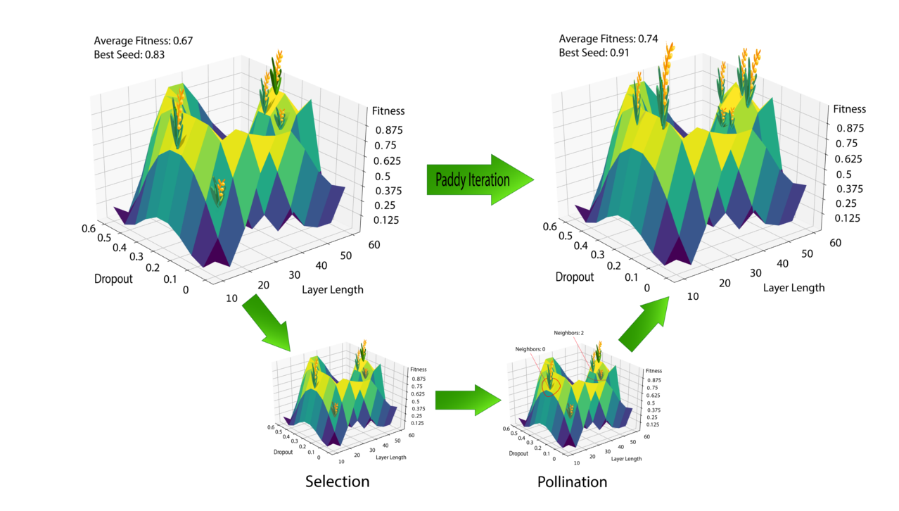

.. Paddy Field Algortihm documentation master file, created by
   sphinx-quickstart on Mon Jul 29 14:33:18 2019.
   You can adapt this file completely to your liking, but it should at least
   contain the root `toctree` directive.

=========
**Paddy**
=========
*a python package designed for parameter optimization*

.. note::
	
	Testing note feature

.. _sec_installation:

Prebuilt Python module for ``pip``
----------------------------------
A prebuilt version of **Paddy** is availible on the *Python Package Index* (PyPi). It can be installed for recent versions of **Python** (*v3.6.3*).
Use the following command to install it.

.. code::

   $ python3 -m pip install paddy

Building the ``Paddy`` module manually
--------------------------------------

.. code:: bash

   $ git clone https://github.com/chopralab/paddy.git
   $ cd paddy
   $ python setup.py bdist_wheel --build-type MinSizeRel -- \
   $   -DPYTHON_EXECUTABLE:FILEPATH=`which python` \
   $   # Other cmake options here
   $ python -m pip install *.whl # The name of the wheel file is dependant on the python version

.. _sec_dependencies:

Dependencies
============
.. note::
   The following dependencies are needed at minimum to run :py:mod:`paddy`:

Requirements for Paddy(*v1.0*)
------------------------------
*versions listed are those known to pass testing*

- |numpy|_ (*v1.15.1*)
- |scipy|_ (*v1.1.0*)
- |matplotlib|_ (*v2.1.0*)

*optional dependencies needed to run* :py:mod:`paddy.Default_Keras_MLP`:

- |keras|_
- |sklearn|_

.. |numpy| replace:: ``Numpy``
.. _numpy: https://numpy.org
.. |scipy| replace:: ``Scipy``
.. _scipy: https://scipy.org
.. |matplotlib| replace:: ``Matplotlib``
.. _matplotlib: https://matplotlib.org/
.. |pickle| replace:: ``Pickle``
.. _pickle: https://docs.python.org/3.6/library/pickle.html
.. |math| replace:: ``Math``
.. _math: https://docs.python.org/3.6/library/math
.. |random| replace:: ``Random``
.. _random: https://docs.python.org/3.6/library/random
.. |keras| replace:: ``Keras``
.. _keras: https://keras.io/
.. |sklearn| replace:: ``scikit-learn``
.. _sklearn: https://scikit-learn.org/stable/

============
API Overview
============
The :py:mod:`paddy` API is as below:

.. toctree::
   :maxdepth: 2

   paddy

==================
Indices and Tables
==================

* :ref:`genindex`
* :ref:`modindex`
* :ref:`search`

